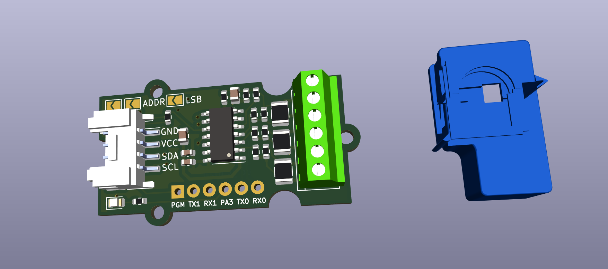
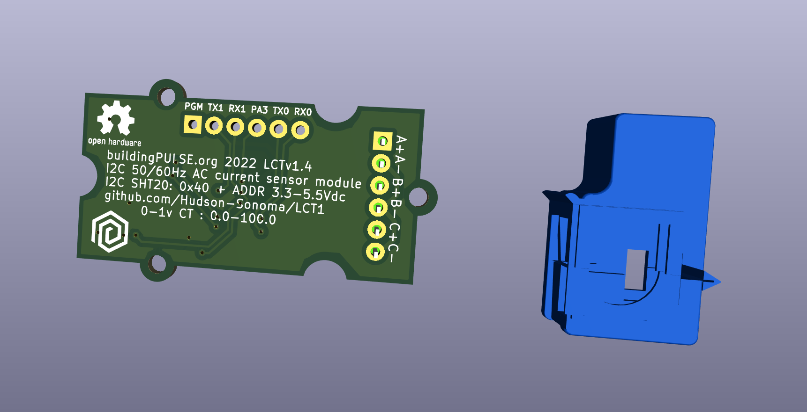

# HCT20
I2C 50/60Hz 100 amp AC current and power factor sensor module with Seeed Grove connector

* I2C AC Current Sensor for 50mA current transformers (with 20Ohm burden resistor) or 0-1Vac current transformer (without resistor)
* 0.0 - 50.0 AC amps reported by the sensor for 0-50mA
* 3.3-5.5 vdc
* 50/60Hz
* % accuracy
* instantaneous AC RMS current measurement (VA)
* power factor 100 - 60 -> 1.00 - 0.6
